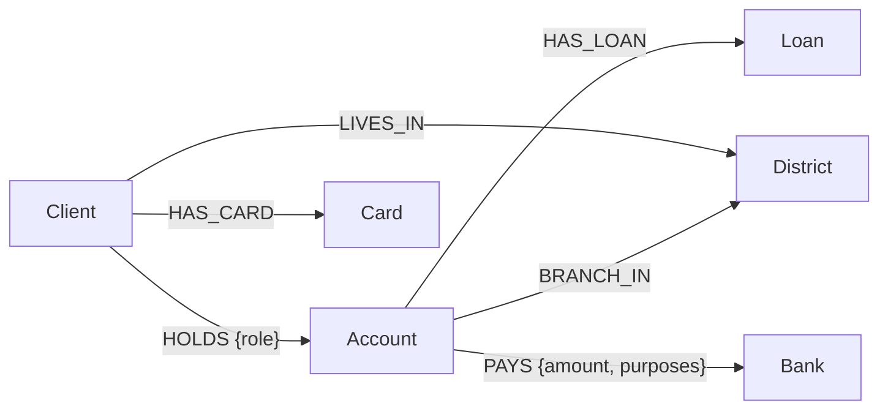
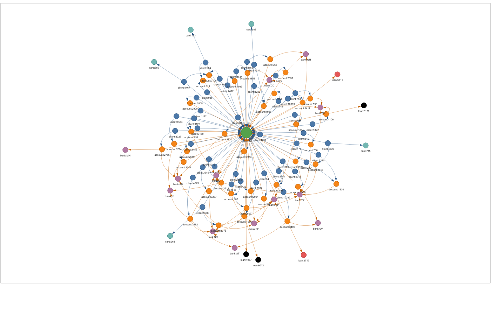

# Banking Knowledge Graph

A small knowledge graph of a real (anonymised) retail bank: its **clients, accounts, loans, cards, branches and payments**. It's used to answer lending questions: a customer 360 view, credit risk, and cross-sell leads.

Built with **Python + NetworkX** (in-memory graph) and **Neo4j / Cypher** (graph database).

## Dataset

[Berka / PKDD'99 Financial Dataset](https://web.archive.org/web/2007/http://lisp.vse.cz/pkdd99/berka.htm): real data from a Czech bank (1993–1998), released publicly for research.
`python main.py download` fetches it and translates the Czech codes into the clean English CSVs in [`data/`](data/). The large transactions table is not used.

## The graph



| Nodes | Count | | Edges | Count |
|---|---:|---|---|---:|
| Client | 5,369 | | PAYS | 6,141 |
| Account | 4,500 | | HOLDS | 5,369 |
| Card | 892 | | LIVES_IN | 5,369 |
| Loan | 682 | | BRANCH_IN | 4,500 |
| District | 77 | | HAS_CARD | 892 |
| Bank | 13 | | HAS_LOAN | 682 |

**11,533 nodes and 22,953 edges, all in one connected graph.**



*One district, from `python main.py draw-district 20`. Colours: green = district, blue = client, orange = account, purple = bank, teal = card, red = loan, **black = defaulted loan**. The HTML version is interactive: drag, zoom, and hover any node for its details.*

## Questions it answers

| # | Question | How (graph walk) |
|---|---|---|
| 1 | **Customer 360:** what do we know about client X? | Client → accounts → loans, cards, standing orders, co-holders, district |
| 2 | **Credit risk by region:** where do loans go bad? | Loan ← Account → District |
| 3 | **Does a joint account change risk?** | Count `HOLDS` edges into each loan's account |
| 4 | **Cross-sell:** who should we offer a card, insurance or refinance to? | Client's loans, cards and payment purposes; skip anyone linked to a default |
| 5 | **How are two entities connected?** | Shortest path between any two nodes |

### Key findings

**Joint accounts almost never default.** Loans on accounts with a second holder had **0 defaults out of 145**. Loans on single-holder accounts had **76 defaults out of 537 (14.2%)**. This signal only exists because the data is modelled as relationships.

| Account | Loans | Defaults | Default rate |
|---|---:|---:|---:|
| joint | 145 | 0 | 0.0% |
| single holder | 537 | 76 | 14.2% |

**Risk varies about 10× by region:** from 1.6% (north Bohemia) to 15.8% (west Bohemia).

**Cross-sell leads (clients in good standing only):** 522 insurance, 441 credit card, 35 loan refinance.

## Run it

```bash
python3 -m venv venv && source venv/bin/activate
pip install -r requirements.txt

python main.py stats              # graph size
python main.py customer 2         # customer 360 for client 2
python main.py risk               # default rate by region / account type
python main.py leads              # cross-sell leads
python main.py path client:1 loan:5314
python main.py draw 2             # one client's neighbourhood -> output/client_2.html
python main.py draw-district 20   # a whole district (~100 nodes) -> output/district_20.html
pytest                            # tests
```

The data is already in `data/`. Run `python main.py download` only if you want to re-create it.

### Neo4j (graph database)

The same graph can be loaded into Neo4j, and the questions run as Cypher. This is tested on a free [Neo4j Aura](https://neo4j.com/cloud/aura-free/) instance (Neo4j 5.27); the Cypher results match the Python results exactly.

1. Create a free Aura instance (or run Neo4j locally).
2. Put its connection details in a `.env` file in the project root (git ignores this file):
   ```
   NEO4J_URI=neo4j+s://<your-id>.databases.neo4j.io
   NEO4J_USERNAME=<username>
   NEO4J_PASSWORD=<password>
   ```
3. Load the graph and run the queries:
   ```bash
   python main.py neo4j-load     # ~11.5K nodes + 23K relationships, about 25 s on Aura
   python main.py neo4j-query    # runs neo4j/queries.cypher
   ```

The queries are in [`neo4j/queries.cypher`](neo4j/queries.cypher). You can also paste any of them into the Aura query editor to see the graph visually.

## Project layout

```
kg/download.py      download + clean the dataset -> data/*.csv
kg/build_graph.py   CSVs -> NetworkX graph (nodes + relationships)
kg/queries.py       the business questions above
kg/visualize.py     interactive HTML view of one client (PyVis)
kg/neo4j_db.py      load the graph into Neo4j + run the Cypher queries
neo4j/queries.cypher  the business questions in Cypher
main.py             command-line entry point
tests/              pytest checks against the real data
```
